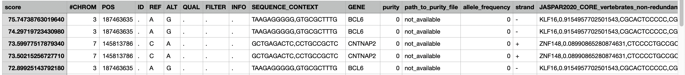
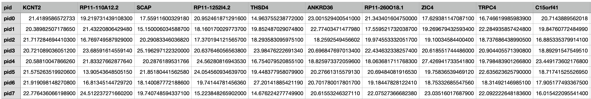

# REMIND-Cancer Pipeline

## General Overview

This directory includes three key subfolders: `utils`, `pipeline_setup`, and `pipeline`, which together comprise the core of the REMIND-Cancer pipeline.

To ensure smooth execution, start by running the functions in the `utils` folder. These will verify the compatibility of your input data and configuration files. Once validation is complete, proceed to initialize the pipeline using the code in `pipeline_setup` and finally execute the main filtering process located in the `pipeline` folder.

After the filtering process is complete, two main output files are generated:

- `final_results_XX-XX-20XX_XX:XX.csv`: This file consolidates all mutations that pass through the pipeline. Entries are ranked in descending order by their REMIND-Cancer score, which reflects the likelihood that a mutation activates its associated gene. Each entry includes additional annotations such as recurrence frequency, known cancer gene association, and overlap with open chromatin regions.
- `results.json`: This file tracks the progress of each sample throughout the pipeline. For every preprocessing, filtering, or annotation step, the file maps the current version of each mutation file to its sample type—whether it's a primary or metastatic tumor, and whether RNA-Seq data is available alongside WGS data. After each stage, a new file is generated with an updated suffix and logged accordingly.

Below is a snapshot of the `final_results` CSV:

<p align="center">
   
</p>

Example `results.json` for a case where a mutation passes preprocessing and promoter filtering, but fails the TF Expression and Motif filter:

```json
{
    "original": {
        "primary_tumor_wgs": [],
        "primary_tumor_wgs_and_rnaseq": ["/path/to/some/sample1_original.vcf"],
        "metastasic_tumor_wgs": [],
        "metastasic_tumor_wgs_and_rnaseq": []
    },
    "_original_after_preprocessing.vcf": {
        "primary_tumor_wgs": [],
        "primary_tumor_wgs_and_rnaseq": ["/path/to/some/sample1_original_after_preprocessing.vcf"],
        "metastasic_tumor_wgs": [],
        "metastasic_tumor_wgs_and_rnaseq": []
    },
    "_original_after_preprocessing_after_promoter_1000up_500down.vcf": {
        "primary_tumor_wgs": [],
        "primary_tumor_wgs_and_rnaseq": ["/path/to/some/sample1_original_after_preprocessing_after_promoter_1000up_500down.vcf"],
        "metastasic_tumor_wgs": [],
        "metastasic_tumor_wgs_and_rnaseq": []
    },
    "_original_after_preprocessing_after_promoter_1000up_500down_after_tf_and_motif_filter.vcf": {
        "primary_tumor_wgs": [],
        "primary_tumor_wgs_and_rnaseq": [],
        "metastasic_tumor_wgs": [],
        "metastasic_tumor_wgs_and_rnaseq": []
    }
}
```

Only the final files listed in this JSON will be included in the aggregated `final_results` CSV.

---

## Details of Each Subfolder

### 1. Utils

Within this subfolder, three validation checks can be ran in order to verify that your configuration file, metadata file and RNA-Seq dataframe are all in order and in the proper format.

#### Configuration File

This file contains keys and values that the pipeline relies on in order to get proper paths for files, output files and proper endings of intermediate files. An example of this can be found in `REMIND-Camcer/examples/results/21March2025/configuration_file.json`. A brief description of the (sub)keys and values can be seen below:

- `pipeline`
  - `dataset`: Identifier for the dataset being used (e.g., "pcawg").
  - `prospective`: Boolean or flag indicating whether the data is prospective.
  - `initial_steps`: Ordered list of initial steps to perform before filtering (e.g., `preprocessing`).
  - `filtering_order`: Ordered list of filtering steps, including any combination of `promoter_filter`, `motif_and_tf_expression_filter`, and `ge_filter`.
  - `additional_annotations`: Ordered list of optional annotations to apply after filtering. Valid values include `cgc_annotations`, `chromhnn_annotations` (for open chromatin), and `recurrence_annotation`. The `recurrence_annotation` evaluates recurrence across all other samples within the analysis.
  - `post_pipeline_steps`: Ordered list of post-processing steps to apply after annotations. Currently supports `postprocessing`.
  - `path_to_results`: Output directory where the final `results.csv` should be saved. Refer to the earlier description in this README for file details.
  - `path_to_metadata`: File path to the metadata file. Its format can be validated using the script at `utils/validate_metadata.py`.
  - `run_on_cluster`: Internal setting intended for use at the German Cancer Research Center (DKFZ) for optimized execution. This was verified as functional as of 11 October 2024, but future users may need to adjust it for compatibility with new environments.
  - `pipeline_folder_setup`
    - `pcawg`: Only relevant when the previously-defined `pipeline.dataset` is equal to "pcawg".
      - `output_path_to_patient_folders`: The output location of where the copied files from the metadata file will be stored. This will particularly be used within the `pipeline_setup` step.
  - `rnaseq_data`
    - `rnaseq_measurement`
    - `pcawg`
      - `path_to_rnaseq_dataframe`
  - `additional_files`
    - `pcawg`
      - `path_to_purity_file`
    - `tss_reference_file`
  - `preprocessing_details`
    - `suffix_to_append_to_vcf`
    - `transcription_factor_prediction`
      - `path_to_fimo_executable`
      - `path_to_jaspar_database`
      - `name_of_tfbs_prediction_column_to_add`
      - `save_tfbs_dictionary`
    - `pcawg`
      - `path_to_genome_reference_fa_file`
  - `promoter`
    - `suffix_to_append_to_vcf`
    - `upstream_of_tss`
    - `downstream_of_tss`
  - `ge_filter`
    - `suffix_to_append_to_vcf`
    - `threshold`
    - `column_name_to_filter`
  - `motif_and_tf_expression_filter`
    - `suffix_to_append_to_vcf`
    - `tfbs_creation_threshold`
    - `tfbs_destruction_threshold`
    - `tf_expression_measure_to_filter`
    - `tf_expression_threshold`
  - `recurrence`
    - `suffix_to_append_to_vcf`
    - `compute_recurrence_with_current_dataset`
    - `additional_recurrence_datasets_to_add`
    - `name_of_column_to_add`
  - `open_chromatin`
    - `suffix_to_append_to_vcf`
    - `path_to_chromhmm_file`
  - `cgc`
    - `suffix_to_append_to_vcf`
    - `path_to_cgc_file`
  - `post_processing`
    - `suffix_to_append_to_vcf`
    - `transcription_factor_information`
      - `path_to_downloaded_jaspar_file`
    - `ncbi_information`
      - `path_to_gene_name_and_description_file`
  - `REMIND-Cancer_scoring_weights`
    - `genomic`
      - `tfbs`
        - `creation_weight_per_tfbs`
        - `creation_weight_maximum`
        - `destruction_weight_per_tfbs`
        - `destruction_weight_maximum`
      - `recurrence`
        - `weight_per_recurrent_mutation`
        - `weight_maximum`
      - `purity`
        - `purity_threshold_for_weight`
        - `purity_weight`
      - `allele_frequency`
        - `af_threshold_for_weight`
        - `af_weight`
    - `transcriptomic`
      - `gene_expression`
        - `weight_per_unit_of_expression`
        - `weight_maximum`
    - `annotations`
      - `open_chromatin`
        - `weight`
      - `cgc`
        - `weight`

#### Metadata file

An example of a properly-formatted metadata file can be found at `data/annotations/metadata_with_local.csv` and can be validated using the script at `utils/validate_metadata_file.py`.

This validation script checks the following:

- That the metadata file exists and can be loaded properly as a CSV.
- That it contains all required columns: `pid`, `tumor_origin`, `path_to_wgs_file`, `cohort`, and `ge_data_available`.
  - **`pid`**: A unique identifier for each sample.
  - **`tumor_origin`**: Must be either `primary_tumor` or `metastatic_tumor`.
  - **`path_to_wgs_file`**: The accessible, tab-delimited VCF file path for each sample's WGS SNV data.
  - **`cohort`**: Indicates the cohort the sample belongs to (if applicable).
  - **`ge_data_available`**: A boolean value (`True` or `False`) indicating whether RNA-Seq data is available. If `True`, the sample must have a matching entry in the RNA-Seq dataframe (explained below).
- That the files specified in the `path_to_wgs_file` column exist.
- That associated VCF files (with the same name but `.vcf` extension) are also present and contain all required columns: `#CHROM`, `POS`, `REF`, `ALT`, `SEQUENCE_CONTEXT`, and `GENE`.

Any missing columns or files are reported in the terminal, making this a useful first step for debugging input setup.

#### RNA-Seq Dataframe

An example of a properly-formatted RNA-Seq file can be found at `data/rna_seq_data/_fpkm_dataframe.csv` and can be validated using the script at `utils/validate_rnaseq_dataframe.py`.

This validation script performs the following checks:

- Ensures the RNA-Seq file exists and is accessible.
- Attempts to load the file as a comma-delimited CSV.
- Verifies the presence of the required `pid` column, which links each RNA-Seq entry to a corresponding sample in the metadata.
- Counts and reports the number of unique `pid` entries (samples) and the number of genes (all columns except `pid`).

If the file is missing, improperly formatted, or lacks the `pid` column, the script will output a descriptive error message to aid in troubleshooting.

Below is a snapshot of an RNA-Seq dataframe:

<p align="center">
   
</p>

### 2. Pipeline Setup

The scripts in this subfolder handle the initial setup required for running the REMIND-Cancer pipeline. These include organizing patient files and generating the initial tracking JSON file.

#### `create_initial_structure.py`

This script prepares your dataset by creating patient-specific directories and initializing the tracking JSON file used throughout the REMIND-Cancer pipeline.

1. **Create Folder Structure**Using information from the metadata file, this step creates a folder for each sample using the format `{pid}_{tumor_origin}`. Inside each folder, it copies the sample’s original `.vcf` file and renames it to end with `_original.vcf`. If a listed VCF file cannot be found, a warning is printed, and the script continues.
2. **Generate `results.json` File**This step scans the created folders and categorizes each sample's VCF into one of four groups based on `tumor_origin` and the availability of RNA-Seq data:

   - `primary_tumor_wgs`
   - `primary_tumor_wgs_and_rnaseq`
   - `metastasic_tumor_wgs`
   - `metastasic_tumor_wgs_and_rnaseq`

   These are saved under the `original` key in `results.json`, which is written to the path specified in the configuration file.

##### Example

Suppose your metadata file contains the following rows:

| pid     | tumor_origin     | path_to_wgs_file     | ge_data_available |
| ------- | ---------------- | -------------------- | ----------------- |
| SampleA | primary_tumor    | /path/to/SampleA.vcf | False             |
| SampleB | metastatic_tumor | /path/to/SampleB.vcf | False             |

After running the script, your output directory will look like this:

```
output_folder/
├── SampleA_primary_tumor/
│   └── SampleA_original.vcf
└── SampleB_metastatic_tumor/
    └── SampleB_original.vcf
```

The resulting `results.json` will contain:

```json
{
    "results": {
        "original": {
            "primary_tumor_wgs": ["/absolute/path/to/output_folder/SampleA_primary_tumor/SampleA_original.vcf"],
            "primary_tumor_wgs_and_rnaseq": [],
            "metastasic_tumor_wgs": ["/absolute/path/to/output_folder/SampleB_metastatic_tumor/SampleB_original.vcf"],
            "metastasic_tumor_wgs_and_rnaseq": []
        }
    }
}
```

To run this setup, use the command:

```
python src/pipeline_setup/create_initial_structure.py -c <path_to_configuration_file>
```

This setup must be completed before running any downstream pipeline components.

### 3. Pipeline

The core functionality of the pipeline resides in the pipeline subfolder, which is organized into four main components: `annotations`, `filters`, `postprocessing`, and `preprocessing`. Each of these contains additional subfolders representing specific steps (e.g., `promoter_filter` which is in the `filters` subfolder). For every step, there are typically two associated Python scripts: one that executes the step for a _single_ WGS file and another that iterates over multiple samples. This structure supports efficient parallelization, which is particularly useful when submitting jobs to a compute cluster, and makes it easy to isolate and re-run individual steps in case of errors.

An overview of the steps within each subfolder can be seen here:

#### Preprocessing

This step prepares each VCF file for downstream analysis by performing multiple cleanup, normalization, and annotation tasks. It consists of two main scripts:

- `_run_preprocessing_on_single_path.py`: Applies preprocessing logic to a single sample.
- `run_preprocessing_on_all_paths.py`: Iterates over all samples defined in the `results.json` file and applies the single-sample script, optionally on a computing cluster.

The main preprocessing tasks include:

- **Gene name cleanup**: Renames misformatted gene names (e.g., removes transcripts or distance annotations in parentheses).
- **Filtering**:
  - Removes rows with missing or invalid gene names (e.g., `NONE`, `Unknown`).
  - Filters out indels by retaining only SNVs (i.e., where both REF and ALT have length 1).
  - Removes germline variants based on reclassification labels (if present).
- **Annotation**:
  - Adds sequence context around the SNV site for PCAWG samples (generating the `SEQUENCE_CONTEXT` column).
  - Annotates each mutation with sample-specific purity and allele frequency.
  - Adds transcription factor binding site predictions using FIMO and a JASPAR motif database.
  - Cleans TF names (e.g., removes lowercase names, parentheses, and compound TF names like `FOSL1::JUND`).
  - Annotates each gene and transcription factor with raw, Z-score, and log-transformed expression values if RNA-Seq data is available.
- The full output is saved to a new VCF file with a suffix defined in the configuration file, and this output path is logged in the `results.json` file.

#### Filters

This subfolder contains the different filtering steps of the REMIND-Cancer pipeline. A description of each implemented feature can be seen below:

#### `promoter_filter`:

  This step filters mutations based on whether they fall within defined promoter regions surrounding transcription start sites (TSS). The promoter region is specified in the configuration file by upstream (`pipeline.promoter.upstream_of_tss`) and downstream (`pipeline.promoter.downstream_of_tss`) base-pair distances from the TSS. Two scripts implement this functionality:

- `_run_promoter_on_single_file.py`: Filters for mutations that lie within the promoter boundaries (inclusive) and writes a filtered file with the additional suffix to append (`pipeline.promoter.suffix_to_append`).
- `run_promoter_on_all_paths.py`: Applies the filtering to all mutation files in the current pipeline stage, either locally or via job submission to a compute cluster.

  The filter works by comparing each mutation’s genomic position and gene symbol to promoter intervals defined in a TSS reference file. Mutations that match the same chromosome, gene, and lie within the computed promoter window are retained. The resulting filtered file is saved with a suffix (e.g., `_after_promoter_1000up_500down.vcf`) and its path is updated in `results.json`. This step also considers the positive or negative strand to calculate the promoter regions.
<br>

#### `motif_and_tf_filter`:

  This step filters mutations based on transcription factor binding site (TFBS) predictions and transcription factor (TF) expression levels. It uses two main scripts:

- `_run_motif_and_tf_on_single_file.py`: Applies the combined motif and expression-based filtering logic to a single VCF.
- `run_all_motif_and_tf_expression_on_all_paths.py`: Applies the filter to all samples in the current pipeline stage listed in `results.json`.

During the preprocessing stage, FIMO is called with a TF collection (e.g. JASPAR2022) in order to predict the binding affinity of TFBS' to both the wildtype (according to a given reference file such as hg19) $ba_{wt}$ and the mutant (sequence with the introduced mutation) $ba_{mut}$. As a mutation could affect multiple TFBSs, _each_ TFBS has their own binding affinity. Next, the ratio between these two $\hat{ba} = \frac{ba_{mut}}{ba_{wt}} $ represents a binding affinity that's used to approximate the likelihood of this singular mutation creating or destroying this TFBS. Using the two _TERT_ pSNVs as a reference in which multiple ETS-factor TFBS' are created, a $\hat{ba}$ of 11 (`pipeline.motif_and_tf_expression_filter.tfbs_creation_threshold`) is used to signify the creation of a TFBS whereas a $\hat{ba}$ of 0.09 (`pipeline.motif_and_tf_expression_filter.tfbs_destruction_threshold`) is used to signify the destruction of a TFBS. This information for each TFBS (separated by a ';') is stored within its own column starting with `JASPAR2020_CORE_vertebrates_non-redundant`.

Now, within this filtering step, each mutation is assessed to determine whether it (1) creates or destroys _at least one_ TFBS based on $\hat{ba}$ and if so, (2) has a detectable expression level (e.g. FPKM greater than 0). If at least one TFBS is either significantly created or destroyed and the corresponding TF has an expression value (raw, z-score, or log) above a configured threshold, the mutation is retained. Otherwise, it is filtered out.

Internally, the script parses TFBS annotations (produced during preprocessing via FIMO and JASPAR), evaluates them using motif and TF expression criteria, and appends the following new columns:

- `created_tfs_passing_tf_expression_threshold`: The name of the TFs (comma separated) that have _both_ a created binding site ($\hat{ba} \geq 11$) and an expression value above 0.
- `destroyed_tfs_passing_tf_expression_threshold`: The name of the TFs (comma separated) that have _both_ a destroyed binding site ($\hat{ba} \geq 11$) and an expression value above 0.
- `remaining_tfs`: All other TFs that did not fall outside of the created/destroyed thresholds and/or had no expression levels.
- `num_created_tfs_passing_tf_expression_threshold`: A count of the TFs in `created_tfs_passing_tf_expression_threshold`
- `num_destroyed_tfs_passing_tf_expression_threshold`: A count of the TFs in `destroyed_tfs_passing_tf_expression_threshold`
- `num_remaining_tfs`: A count of the TFs in `remaining_tfs`

Filtered files are saved with a configurable suffix (e.g., `_after_motif_and_tf_exp_filter.vcf`) and paths are logged in `results.json` under the new pipeline stage.

#### `ge_filter`:
  This filter step only keeps mutations that are associated with genes whose expression surpasses a threshold defined within the configuration file (`pipeline.ge_filter.threshold`). As the pipeline is trying to detect pSNVs that lead to a relative _upregulation_, the normalized expression (e.g. FPKM z-score) is, by default, the measurement that will be filtered. Two scripts implement this functionality:

- `_run_ge_on_single_file.py`: Filters for mutations that lie within the promoter boundaries (inclusive) and writes a filtered file with the additional suffix to append (`pipeline.promoter.suffix_to_append`).
- `run_promoter_on_all_paths.py`: Applies the filtering to all mutation files in the current pipeline stage, either locally or via job submission to a compute cluster.

  The filter works by comparing each mutation’s genomic position and gene symbol to promoter intervals defined in a TSS reference file. Mutations that match the same chromosome, gene, and lie within the computed promoter window are retained. The resulting filtered file is saved with a suffix (e.g., `_after_promoter_1000up_500down.vcf`) and its path is updated in `results.json`. This step also considers the positive or negative strand to calculate the promoter regions.
<br>

#### Annotations

- **`cgc_list`**:
  This step annotates each mutation with whether it overlaps a gene listed in the Cancer Gene Census (CGC). It involves two scripts: one (`_add_cgc_information_to_single_file.py`) processes a single VCF file by adding a new column `within_cgc_list`, which is `True` if the mutation’s gene appears in the CGC dataset. The second script (`add_cgc_to_all_paths.py`) loops through all VCFs listed in the latest stage of `results.json`, runs the single-file script either locally or on a computing cluster, and saves the updated files with a user-defined suffix. The results are then tracked under a new key in `results.json`, allowing downstream steps to access CGC-annotated data.
- **`chromhmm`**:
  This step annotates each mutation with whether it falls within a region of open chromatin, as defined by ChromHMM segmentations. It consists of two scripts: the single-sample script (`_add_chromhmm_to_single_file.py`) loads a VCF and a ChromHMM annotation file, checks whether each mutation lies within any annotated open chromatin regions, and appends a boolean column `open_chromatin` to the VCF. The batch script (`add_chromhmm_to_all_paths.py`) applies this logic across all relevant samples listed in the current stage of `results.json`, running either locally or on a cluster. Results are saved with a specified suffix and tracked under a new key in `results.json`, allowing downstream pipeline steps to access this annotation.
- **`recurrence`**:
  This step determines whether a given mutation recurs across different samples in the dataset or in external datasets. It is composed of two scripts: one (`_add_recurrence_to_single_file.py`) processes a single VCF file by comparing each mutation to recurrence dictionaries—either computed from the current dataset or loaded from external JSONs. Mutations that appear at the same genomic position, with the same alternate allele and gene, but in different patients, are considered recurrent. A summary string of matching entries and a count of recurrent matches are appended as new columns. The second script (`add_recurrence_to_all_paths.py`) loops through all current VCF files in `results.json`, submits the single-file script either locally or to a cluster, and saves the updated output using a configured suffix. The recurrence step supports cohort-specific recurrence tracking and is logged as a new key in `results.json` for downstream use.

  Internally, the recurrence step works by identifying mutations that share the same chromosome, genomic position, gene, and alternate allele across different patients. A recurrence dictionary is created from either the current dataset or supplemental datasets (if configured), and mutations are matched against this dictionary. For each match found, the pipeline appends two new columns: one containing a semicolon-separated list of matching mutation metadata (defined within configuration file under `recurrence.name_of_column_to_add`, which defaults to `paths_with_recurrence(format=path,pid,cohort,bp,ref,alt,gene,chr,raw_score,zscore,log_score,confidence,purity,af)`), and another recording the total number of recurrences. This enables downstream scoring steps to weigh recurrent mutations more heavily, improving prioritization of potentially driver events.
